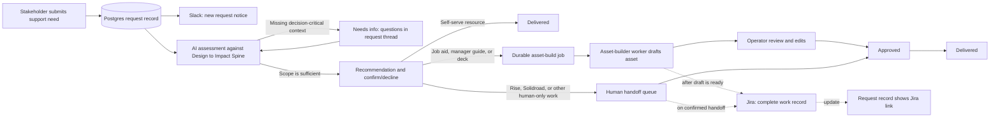

# Enablement Do-er: Backend Overview for Operations

**Purpose:** The Enablement Do-er is a diagnosis-first intake and delivery workflow for one-off enablement needs. It does not assume that training is the answer. It collects business context, assesses the underlying gap, recommends the smallest appropriate intervention, and either creates a review-ready asset or routes the work to a human owner.

This describes the backend in `main` as of **August 3, 2026**. The Jira gateway status reflects the last live ACOS catalog check on **July 30, 2026**. It is intended for the Enablement Operations team—not as an API specification.

## What happens to a request

### 1. Intake and initial assessment

1. A signed-in stakeholder submits the intake form. Required inputs include the situation, business impact, success measures, desired behavior, audience, timeline, stakeholders, source materials, and accountability.
2. The app writes the request and an initial `submitted` audit event to Postgres before any downstream work starts.
3. It posts a best-effort **New support request** message to the configured Enablement Slack channel. A Slack failure does not lose the request.
4. The assessment runs after the web response returns. It uses the embedded Design to Impact Spine and the stakeholder's supplied information and conversation—not an unverified search of other systems.
5. If the request lacks decision-critical context, the app posts focused questions in the request thread and moves the request to **Needs info**. If sufficient, it presents a recommendation and asks the stakeholder to confirm or decline it.

The assessment explicitly considers knowledge, skill, motivation, environment, process, and manager support. A manager's suggested solution is an input, not a binding instruction to produce training.

### 2. Confirmed route

The backend derives the autonomy level from the deliverable type; the AI model cannot bypass this gate.

| Route | Backend behavior | Human responsibility |
| --- | --- | --- |
| Self-serve resource | Request is marked delivered after confirmation; no new asset is generated. | Ensure the recommended resource remains current. |
| Job aid or manager guide | Creates a durable asset-build job. The worker drafts Markdown and a downloadable `.docx`. | Review, edit if needed, approve, then mark delivered. |
| Deck | Creates a durable asset-build job and produces a review-ready slide storyboard with an in-app preview and JSON source. | Review/approve and use the storyboard to create the final presentation where needed. A production PPTX renderer is not currently deployed. |
| Rise course, Solidroad simulation, or other | Moves to **Human build needed**. | An operator takes the work into the appropriate build process. |

### 3. Asset generation and review

The `asset-builder` runs as a separate Spark worker, not as request-bound background work. It:

- atomically claims queued work in Postgres, records an attempt, and renews a heartbeat;
- requeues stale work after a worker interruption;
- snapshots the intake, latest assessment, stakeholder conversation, and explicitly retrievable Confluence sources before drafting;
- stores a draft and artifact metadata durably; and
- stores the private output in Spark-provisioned S3. Only the requester or an operator can use the download route.

The request becomes **Draft ready** only after the worker has completed the draft. Operators can edit or regenerate a draft, approve it, and mark it delivered. A failed build keeps its source inputs and is retryable by an operator.

## Jira and Slack behavior

### Slack

Slack is accessed through the ACOS-managed Slack connection—not an incoming webhook. When `SLACK_CHANNEL_ID` is configured, the app posts operational notices for:

- a new request;
- an asset build being queued;
- a human build handoff;
- final delivery; and
- weekday nudges for requests waiting on information or a decision.

Every Slack card includes a button back to the SSO-protected request record. Slack notification delivery is intentionally best effort: the Postgres record and audit trail remain the source of truth.

### Jira

The intended Jira project is **GEP / Global Enablement Programming**, using the **Global Enablement Programming Request** issue type. Jira creation is deliberately late enough to include useful context:

- **Autonomous asset:** the worker creates the Jira item only after it has produced the review-ready draft.
- **Human-only handoff:** the app attempts Jira creation once the stakeholder has confirmed the handoff.

When creation succeeds, the app saves the Jira key and clickable URL on the request. It resolves the current GEP service desk, request type, and portal fields immediately before the write; all JSM field text is plain text, not Atlassian Document Format. The description is designed to be a complete handoff record: intake answers, assessment, stakeholder/agent conversation, asset summary, draft excerpt, and an authenticated asset-download link where applicable. The app verifies the resulting customer request, then resolves and adds the requester as a JSM participant. Later stakeholder messages sync as portal-visible comments; operator messages sync as internal comments.

Jira sync is guarded by `JIRA_AUTOCREATE_ENABLED`, which defaults to **disabled** and remains disabled for the pilot. The JSM endpoint grants must be active first. The app does not use `raiseOnBehalfOf` until the `ac-spark` account's GEP Service Desk Agent role is confirmed.

## Current Jira pilot boundary

The managed ACOS Jira gateway now exposes the native JSM service-desk, request-type, request-type-field, customer-request, comment, and participant endpoints. The app is pinned to `@activecampaign-os/data-client` `0.27.x` so those methods are available.

The remaining gates are deliberate:

- Spark must approve the three declared Jira write endpoint grants.
- GEP administration must confirm whether `ac-spark` has the Service Desk Agent role before `raiseOnBehalfOf` can ever be enabled. The app currently uses the separate participant endpoint instead.
- One explicitly approved synthetic request must verify the Jira record, requester participant, follow-up comment, and Slack delivery.

**Idempotency note:** the gateway can protect a fast retry with the same caller key, but its cache is per pod. The app never treats that as a distributed deduplication guarantee: after a network-uncertain create, an operator must inspect Jira before retrying.

## Controls, ownership, and evidence

| Control | How it works |
| --- | --- |
| Identity | Requester identity comes from SSO. Write routes require an authenticated user. |
| Operator actions | Approval, delivery, draft edits, rebuilds, manual reassessment, and Data Wizard handoff recording are operator-gated. `OPERATOR_ALLOWLIST` can restrict this further; when unset, all signed-in users are treated as operators. |
| State transitions | The backend rejects illegal lifecycle changes with `422`; users cannot jump straight to a generated or delivered state. |
| Auditability | Every significant action is persisted as a `RequestAction` with actor, source (`ui`, `system`, or `cron`), timestamp, and metadata. Assessments, conversation, feedback, builds, and artifact metadata are all retained with the request. |
| AI output safety | Deliverable autonomy is enforced in server code, output is schema-validated, and the app preserves explicit gaps rather than treating undocumented source material as evidence. |
| Asset access | Artifacts live in private Spark S3 storage and are downloaded only through an SSO-checked application route. |
| Recovery | Asset jobs use atomic claims, heartbeats, stale-job recovery, retry, and regeneration. Jira retries are explicit and auditable. |

## Operational cadence

- The **queue** groups work into waiting-on-stakeholder, asset-builder, human-build, and approval/delivery states so operators can work the oldest item first.
- A weekday Spark cron checks stale requests in **Needs info** and **Recommended**, posts a Slack nudge, and logs the action. It does not change the stakeholder's decision or create an asset.
- An optional weekly cron can refresh the embedded Design to Impact Spine from the configured Confluence page. It requires the page ID and ACOS Confluence access; otherwise it safely no-ops.
- Diagnostics are read-only unless explicitly invoked with a test option. Use `/api/diagnostics/integrations` to check Jira/Slack readiness, `/api/diagnostics/spine` to verify the active framework copy, and `/api/health` for service health.

## What Operations should expect today

1. The team can submit, assess, scope, recommend, confirm, create review-ready job aids/manager guides/deck storyboards, review them, and deliver them through the app.
2. Slack operational notifications can be used when the channel is configured.
3. Rise and Solidroad work intentionally appears in the human handoff queue.
4. Jira creation is **not yet enabled** for GEP. The JSM contract and app integration are ready, but endpoint grants and the guarded pilot remain before it is live.
